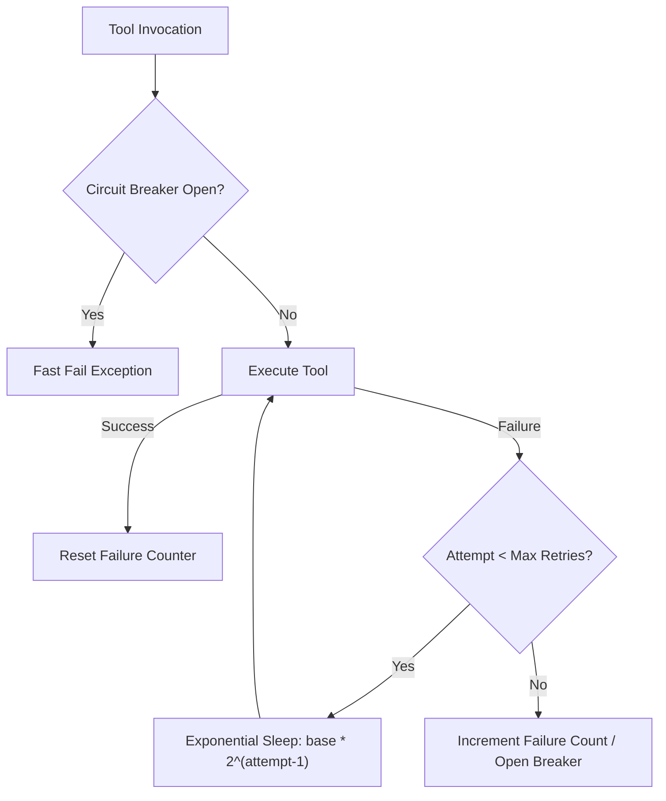

# genpark-agentic-tool-call-retry-backoff-skill

Agent Skill implementing **Exponential Backoff & Circuit-Breaker Resilience** in 100% Python standard library.

## Architectural Flow

```mermaid
flowchart TD
    Call["Tool Invocation"] --> BreakerCheck{"Circuit Breaker Open?"}
    BreakerCheck -->|Yes| FastFail["Fast Fail Exception"]
    BreakerCheck -->|No| Exec["Execute Tool"]
    Exec -->|Success| Reset["Reset Failure Counter"]
    Exec -->|Failure| RetryCheck{"Attempt < Max Retries?"}
    RetryCheck -->|Yes| Backoff["Exponential Sleep: base * 2^(attempt-1)"]
    Backoff --> Exec
    RetryCheck -->|No| Trip["Increment Failure Count / Open Breaker"]
```
